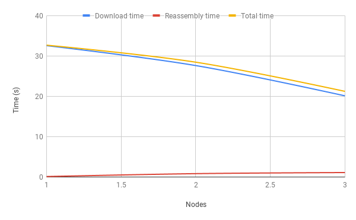
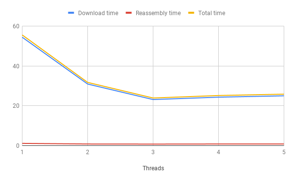

# swift: Collaborative download
```
   _____         _ ______ 
  / ___/      __(_) __/ /_
  \__ \ | /| / / / /_/ __/
 ___/ / |/ |/ / / __/ /_  
/____/|__/|__/_/_/  \__/ 
```

Collaborative Download: CS60002 Distributed systems project

Swift is designed to use to solve the problem of huge file downloads by leveraging a distributed approach. It divided a file into chunks, which are assigned to be downloaded by its peers/ collaborators. Once every peer completes its download, the chunk is sent back to the requester and local cache is deleted. The requester finally reassembles the requested file by merging the chunks it receives from its peers.

Swift is intended to be used on a local network of systems (strongly connected), which are also connected to internet. A special node keeps track of nodes in this collaborative network, updating and sending peers list to any new / downloading node. This special node is called the discovery, and it cannot itself participate in the download process. All other nodes execute a server and a client, the server for handling downloads and the client for handling user requests.

## Features

* Crash resistant - If a node crashes during download, its job is automatically reassinged to all other nodes. For n nodes, with the requester not crashing, upto (n-1) fault tolerant.
* Simultaneous downloads - Since every download is executed on a thread, multiple nodes can request for multiple files.

## Analysis

### Number of nodes in network (threads = 4)

Request: http://intersci.ss.uci.edu/wiki/eBooks/BOOKS/Principa%20Mathematica%20Newton.pdf

File size: 78.3 MB

Nodes | Download time(s) | Reassembly time (s) | Total time (s)
--- | --- | --- | ---
1 | 32.535 | 0.116 |32.651
2 | 27.6 | 0.835 | 28.435
3 | 20.105 | 1.106 | 21.211



We observe that since each node has lesser size to download, download time reduces as nodes in the network increase, however reassembly time increases since the number of chunks is more. The reassembly time will increase linearly, however can be reduced significantly by using memory mapping, instead of storing into local files and concatenating them.

### Number of threads for downloading in each server(nodes = 2)

Same file is requested

Nodes | Download time(s) | Reassembly time (s) | Total time (s)
--- | --- | --- | ---
1 | 54.417 | 1.134 | 55.551
2 | 30.917 | 0.816 | 31.733
3 | 23.133 | 0.774 | 23.907
4 | 24.328 | 0.824 | 25.152
5 | 25.012 | 0.82 | 25.832



As number of nodes in network are constant, reassembly time is more or less constant. The download time first decreases until threads=3, then increases, but by a small amount. This could be due to although each thread has lesser size to download, thread-level reassembly time within each server increases. Again, this could be optimised as described above. We could arrive at an optimal number of threads to use, when reassembly time is reduced. Using these observations, we set the number of threads as 3 in our system.


## Setup

```bash
$ pip3 install -r requirements.txt
```

```bash
sudo ufw allow from any to any port 8000 proto tcp
sudo ufw allow from any to any port 5000 proto tcp
sudo ufw allow from any to any port 6000 proto tcp
```

## Running the project

We need to run a central discovery server, since KGP's internet disables ICMP messages and we cannot broadcast to computers outside our subnet.

```bash
$ python3 discovery.py
```

The IP of the discovery server must be known to every connecting node. The discovery node can also be a collaborative node.

```bash
$ python3 node.py
```

A sample run output can be viewed in [log.txt](log.txt)

## Collaborators

* Kaustubh Hiware [@kaustubhhiware](https://github.com/kaustubhhiware)
* Surya Midatala [@kofls](https://github.com/kofls)
* Aditya Bhagwat [@eraseread](https://github.com/eraseread)
* Pranay Pratyush [@pranaypratyush](https://github.com/pranaypratyush)

Note, run `pipreqs . --force` before pushing.

## Possible enhancements

* Currently reassembly is done via files. This can be optimised using memory mapping, to reduce reassembly time.
* Experiment on what number of nodes the total download time starts to plateau. Let's say s is filesize, r is the rate of download, n nodes, a be reassembly time, the total time would be: O ( (s / n * r) + n * a). Using first and second differentials a value of n could be obtained, considering steady uniform internet connection on all nodes.
* Load balancing - based on bandwidth for each node. Instead of assigning equisized ranges to each server, each server can report its load (either inverse of bandwidth, or CPU load) and ranges are assigned accordingly.
* Heartbeat, so that if requesting client crashes, other servers can stop downloading that requested file.

## References

* [GRPC](https://grpc.io/docs/quickstart/python.html)
* [Distributed Downloader and Manager](https://github.com/code-master5/Distributed-Downloader-and-Merger)
* [P2P system](https://github.com/kushkgp/P2P_System)
* [Distributed download](https://github.com/tazzaoui/distributed-download)
* [py-ifps](https://github.com/ipfs/py-ipfs)
* [Distributed File Storage](https://github.com/kavyasahai/DistributedFileStorage)

## License

The MIT License (MIT) 2019 - [Kaustubh Hiware](https://github.com/kaustubhhiware). Please have a look at the [LICENSE](LICENSE) for more details.

